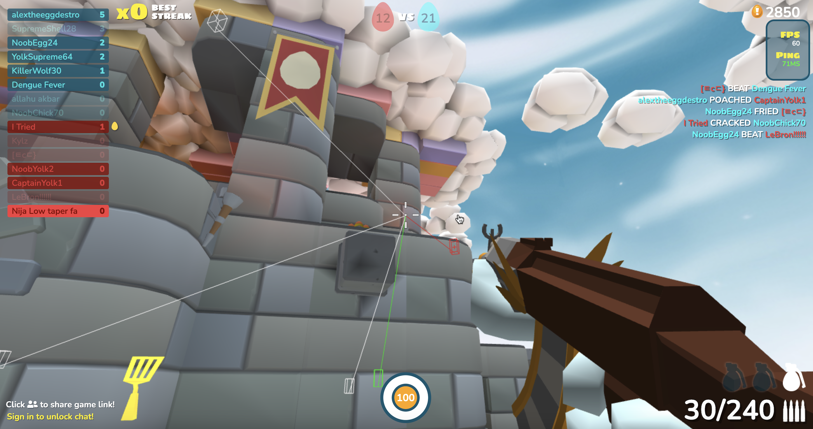
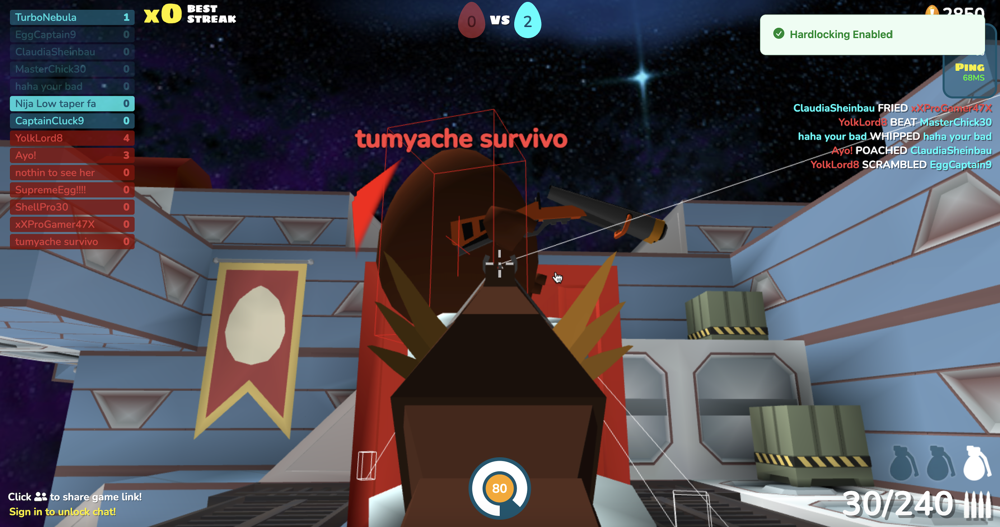
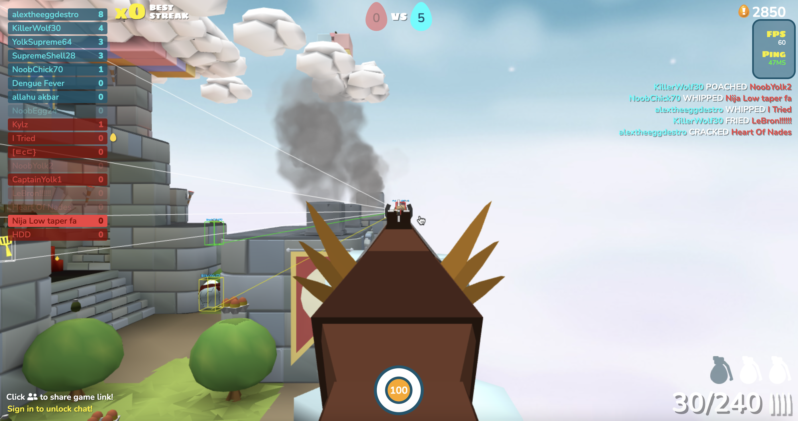

  

<h1 align="center">MingleClient</h1>

ShellShockers hack client with two-loop aimbot, predictive aiming, &amp; bloom correction. Hold SHIFT (configurable) to aim. Press C to toggle rage (hardlocking) mode. Includes ESP (Digit 1) &amp; Tracers (Digit 2).

Colorized Tracers

Aimbot predicting position &amp; toggle notification

ADS with Lock-on

